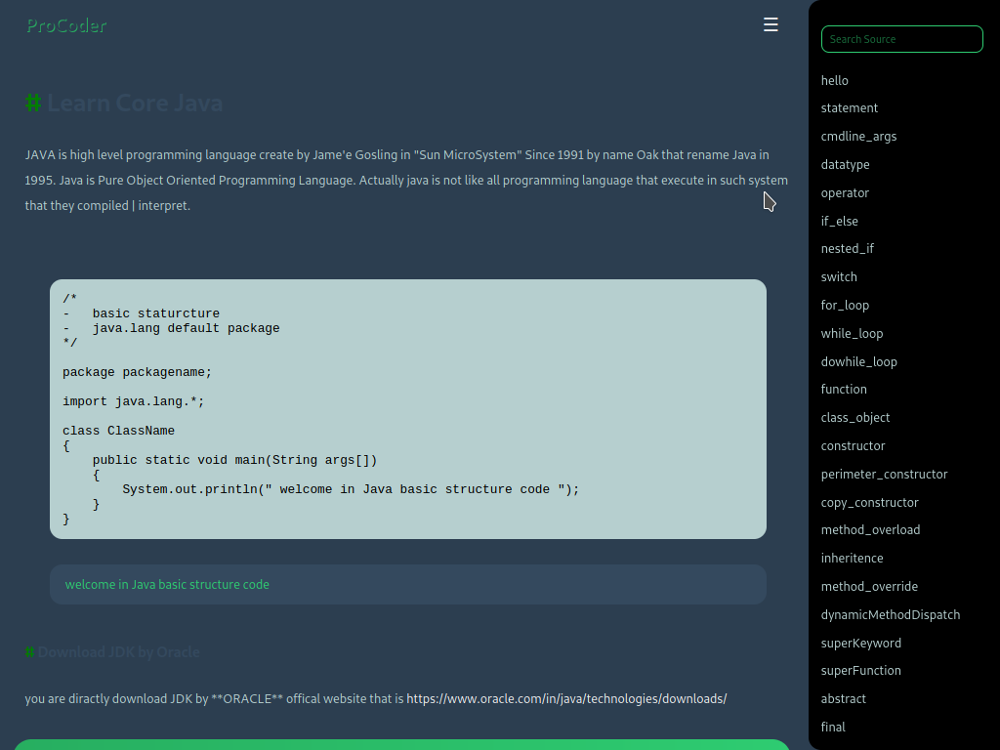

# website-7

- Name : "LearnJavaLanguage"

- Description : "Learn Core Java with notes and source code example"

- Version : 1.0

- Update : 23-09-2023

- Status : ACTIVE

- Responsive : True

- TecStack : { HTML | CSS | JavaScript }

- Thanks : { VSCode | GitHub | MayankDevil }

- Work : Self

- Design : { Mayank }

- Developer : { Mayank }

- CopyRight : { ProCoders }

- URL : https://mayankdevil.github.io/website-7/

- Clone : https://github.com/MayankDevil/website-7.git

- Download : https://github.com/MayankDevil/website-7/archive/refs/heads/main.zip

---

### Web Page

### Responsive

**Breakpoints** { 576 | 768 | 1200 }

### Theme Mode

_Green Black night theme_

